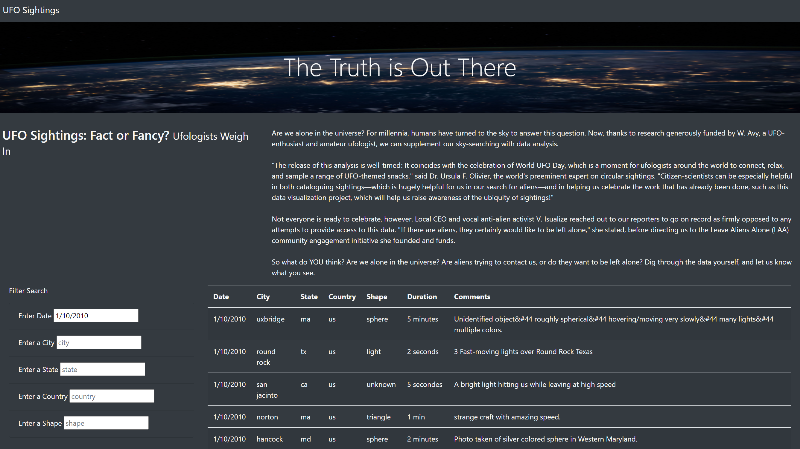
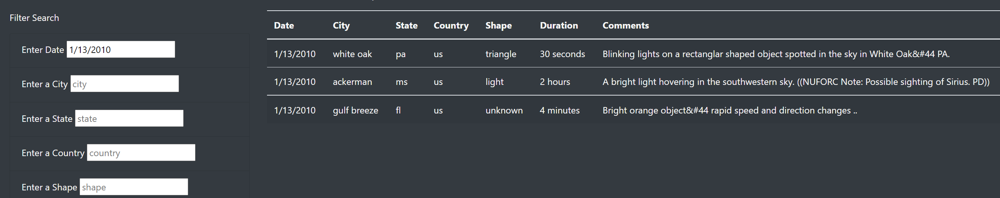
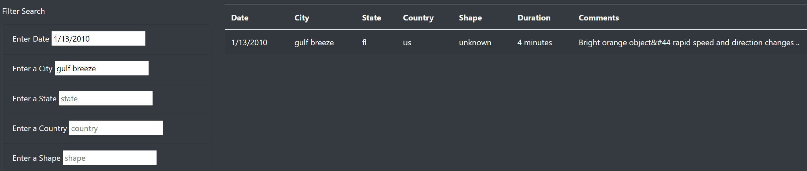
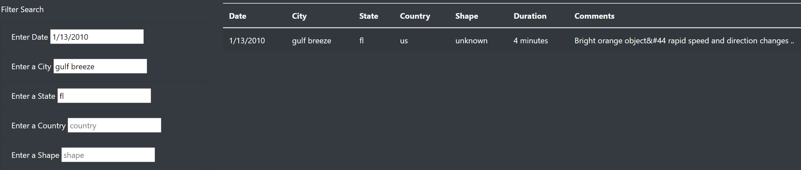
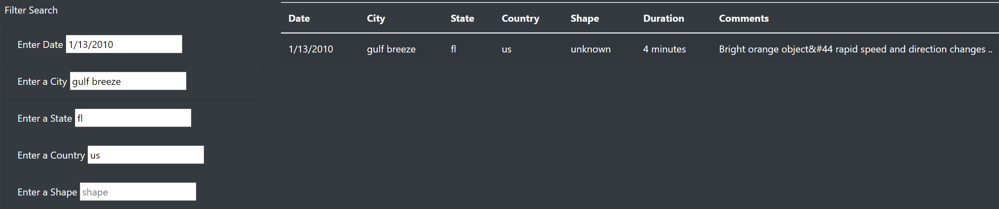
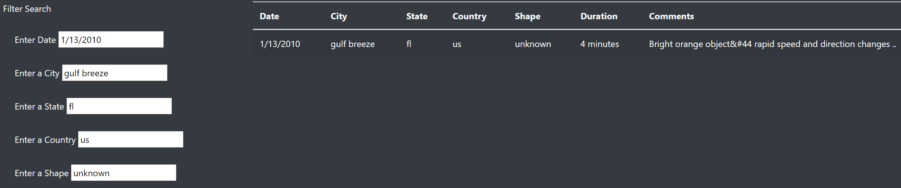
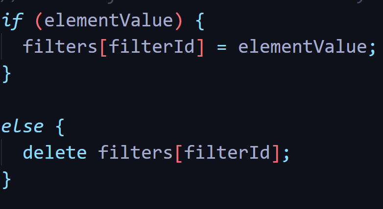

# UFOs
A project on retrieving data about all the news obout UFO's in McMinnville, Oregon

UFO Project
## 1. Overview of Project:
Dana, a Data Analyst wants to write about her hometown McMinnville, which is famous for UFO sightings. She wants to present all of the data using powerful tools like JavaScript and Html. Also styling of the html page using css (cascade styling sheets) in order to make her work presentable.

Tools used : JavaScript, HTML, CSS

	 

## 2. Results: 
The webpage, designed using java script, html and css has lot of information on it. It has a beautiful image with a statement “The Truth is Out There” in order to attract readers to go further into the webpage. It draws more attention by putting a question there – “UFO Sightings: Fact or Fancy?” and showing what the Ufologist have to say about it. Also it gives us the information in a tabular format about all the UFO sightings that happened in the past. The table contains all the information as to the date, city, state, country, shape of the UFO seen, duration of the UFO and some comments describing about the UFO. There are quite a few listings in the UFO table, which is good enough amount of data to increase the curiosity or interest of the readers.

We made this webpage dynamic by adding a few search filters. These filters will help the readers to filter the data on the parameters of date, city, state, country and shape. The readers can also choose to just enter a single filter.

Filter on date : The data can be filtered on date in order to only show data that pertains to that date.

Filter on date & city : The data can be filtered further on city and other parameters. Below is the snapshot of data filtered on date and city.

Filter on date, city & state : We filtered the data further on state in the below image.

Filter on date, city, state, country : Further filtering the data on country, gave the following results.

Filter on date, city, state, country & shape : The data was filtered further on shape in the below image.
 	

The filtration can be done on any parameter, it doesn’t need to have the filtration input in all cells, as we have also written a code to delete the filter in case there is no input value. Below is the code for the same :

## 3. Summary:

### Drawbacks
The design of the webpage along with interactive user interface makes it really appealable to its readers, but there are some drawbacks in the webpage as listed below:
1.	Filter: Though the filter is pretty dynamic and changes the data in the table as an input is given in the filtration cell and immediately reflects the filtered table on the side. It still does not take into consideration case sensitivity and also does not consider the search to be on the basis of the data available.

2.	Source of data: The source of data for this webpage is a JavaScript file, hence the data needs to be updated frequently to keep the web page updated with latest info.

### Recommendations for future development of the webpage:
1.	Filter input: In order to make the webpage filter more user friendly, the cells for the input should show a drop box list of the available options to filter based on the data that is available. That way if the data was filtered on a particular city then the state filter will only show states that have the that city. This way the scope of error on part of the user is drastically reduced and hence will make the web page filter results more accurate.
2.	Filter case sensitivity: The filtration currently is case sensitive, hence if a state is entered in all caps and not in the same case as in the data file, the filter fails. Hence, we need to either switch off the case sensitivity of the input data or change the input to match as in the data file and then run the cell.
3.	Sourcing data: Instead of sourcing the data from the JavaScript file, it can simply be sourced from the webpage itself in order to keep the data up to date.
